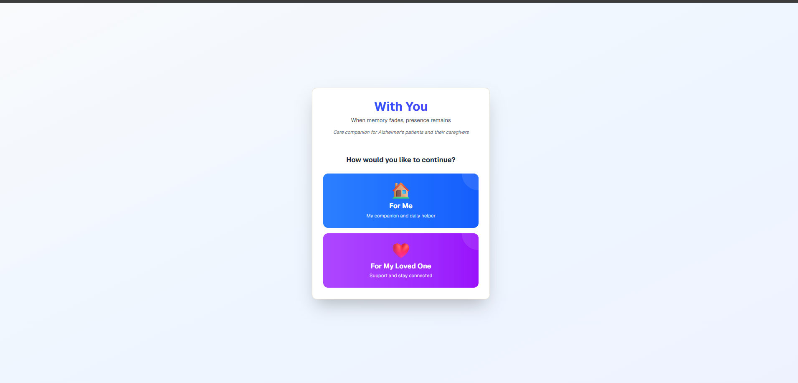
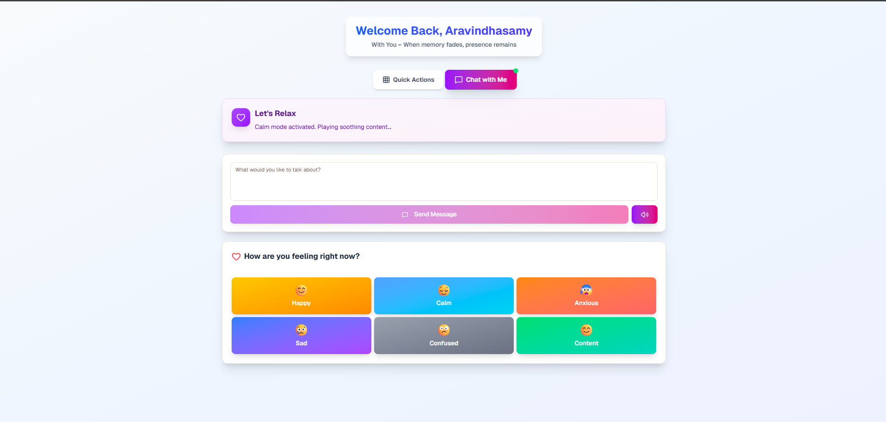
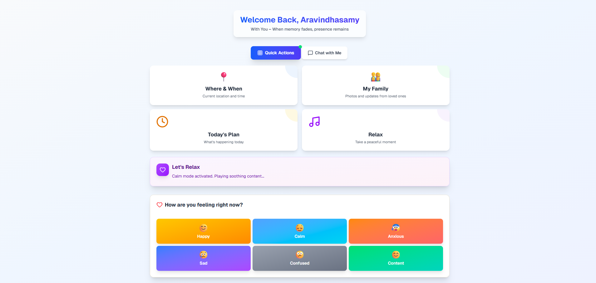
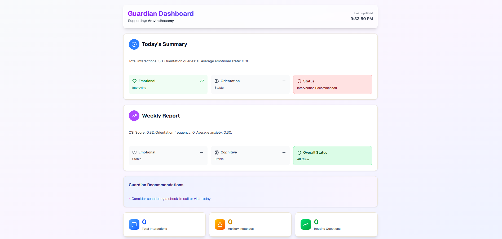

# With You - Project Description

**"With You – When memory fades, presence remains."**

## Overview

**With You** is an AI-powered cognitive support system designed for individuals with early-stage Alzheimer's disease and their caregivers. It's not a reminder app—it's a persistent emotional memory companion that protects identity, relationships, emotional safety, and personal story continuity.

## Core Philosophy

With You operates on an **identity-first AI architecture** that prioritizes:

- **Identity**: Preserving who the person is
- **Relationships**: Maintaining connections with loved ones
- **Emotional Safety**: Protecting dignity and reducing anxiety
- **Personal Story Continuity**: Ensuring life narrative remains intact

## The Cognitive Mesh Architecture

Instead of a single chatbot, With You uses a **multi-agent system** where specialized AI agents work together quietly in the background. Each agent has a clear responsibility:

### 🌞 Aurora - The Orchestrator
**Role**: Central coordinator and traffic controller

Aurora decides:
- What the patient is asking
- Which agent should respond
- Whether the patient sounds anxious
- If caregiver alert is needed

Aurora directs intelligence but does not store memory.

### 🏠 Harbor - The Orientation Agent
**Role**: Keeps the patient grounded

Harbor answers:
- What day is it?
- Where am I?
- Who is visiting today?
- What is happening next?

Harbor handles repeated questions gently and increases reassurance if confusion rises, protecting stability and safety.

### 👨‍👩‍👧 Roots - Identity & Relationship Agent
**Role**: Protects relational identity

Roots answers:
- Who is this person?
- How am I related to them?
- What is our shared history?

Roots maintains family structure, emotional importance of relationships, and shared memories—protecting familiarity and belonging.

### 💬 Solace - Emotional Intelligence Agent
**Role**: Detects and regulates emotional distress

Solace monitors:
- Tone of voice
- Word patterns
- Anxiety signals
- Repetition frequency

When distress is detected, Solace calms the patient, activates Calm Mode, and alerts caregivers if needed—protecting emotional safety and dignity.

### 🧠 Echo - Memory Layer Agent
**Role**: Long-term memory preservation

Echo:
- Stores conversation history
- Tracks emotional trends
- Detects cognitive patterns
- Identifies increasing repetition

Echo enables predictive anxiety detection and longitudinal emotional modeling, protecting continuity over time.

### 👩‍⚕️ Guardian - Caregiver Agent
**Role**: The caregiver co-pilot

Guardian provides:
- Daily cognitive summary
- Emotional trend insights
- Escalation alerts
- Simple analytics dashboard

Guardian helps caregivers act early instead of reacting late.

### 🌅 Legacy - Story Continuity Agent
**Role**: Maintains life narrative

Legacy gently reinforces personal history and prevents identity erosion. When the patient references their past, Legacy completes the narrative with dignity and respect.

## Operating Modes

### Mode A - Structured Navigation (Button Mode)
Used when the patient taps predefined buttons like "Family Photos" or "Where am I?"

**Characteristics**:
- Fast and stable
- Controlled and low-risk
- No advanced AI reasoning needed
- Best for moderate cognitive stages

**Flow**:
1. Patient taps button
2. Aurora routes directly to correct agent
3. Agent retrieves stored information
4. Response shown/spoken

### Mode B - Free Speech Mode
Used when patient speaks naturally: "Is Anna coming today?"

**Characteristics**:
- Emotional understanding
- Anxiety detection
- Intelligent routing
- Context awareness
- Predictive intelligence

**Flow**:
1. Voice converted to text (Azure Speech)
2. Aurora analyzes meaning and emotion (Azure OpenAI)
3. Aurora selects correct agent
4. Agent retrieves memory from database
5. Response delivered and optionally spoken back

## Technology Stack

### AI & NLP
- **Azure OpenAI**: Intent understanding, natural language processing, emotion detection
- **Azure Speech Services**: Voice-to-text and text-to-speech capabilities

### Backend
- **FastAPI**: Python-based REST API server
- **Python**: Core programming language
- **SQLite**: Relational database for structured data storage

### Frontend
- **Next.js**: React-based web framework
- **TypeScript**: Type-safe frontend development
- **Tailwind CSS**: Styling and responsive design

### Storage
- **SQLite Database**: Stores memory, relationships, events, and cognitive metrics
- **Azure Blob Storage**: Stores photos, audio files, and media assets

## Database Design

### 1. Users Collection
Stores basic patient profile, age, diagnosis stage, and caregiver contact information.

### 2. Relationships Collection
Stores family members, relationship types (daughter, son, spouse), descriptions, importance levels, and photo references.

### 3. Events Collection
Stores daily schedule, appointments, visits, and routine reminders.

### 4. Interactions Collection
Stores conversation history, question frequency, emotional tone markers, and repetition counts.

### 5. Cognitive Metrics Collection
Stores trend data including orientation frequency, anxiety averages, repetition patterns, and escalation flags.

## User Experience

### Patient Interface
- Large, simple buttons for easy interaction
- Voice-enabled natural conversation
- Calm Mode for anxiety reduction
- Family photo browsing
- Emergency contacts access
- No harsh corrections or reminders of forgetfulness

### Caregiver Dashboard
- Add/manage family member profiles
- View cognitive trends and insights
- Monitor emotional patterns
- Receive escalation alerts
- Access conversation summaries
- Track orientation and memory metrics

## Key Differentiators

1. **Identity-First Design**: Protects dignity and personal identity above all
2. **Predictive Anxiety Detection**: Intervenes before distress escalates
3. **No Harsh Corrections**: Never says "you forgot" or "I told you before"
4. **Multi-Agent Intelligence**: Specialized agents for different needs
5. **Longitudinal Tracking**: Monitors cognitive patterns over time
6. **Dual Interface**: Separate, optimized experiences for patients and caregivers
7. **Emotional Safety**: Continuous monitoring and gentle reassurance
8. **Story Continuity**: Actively prevents identity erosion

## Behavioral Guardrails

The system follows strict ethical guidelines:

- Never assumes cognitive decline
- Never provides medical diagnosis
- Never corrects harshly or dismisses emotions
- Never argues with confusion or distorted memory
- Always validates feelings and provides reassurance
- Always maintains dignity and respect
- Always prioritizes emotional safety over accuracy

## Sample User Scenarios

### Scenario 1: Orientation Question (Button Mode)
**Patient**: *Taps "Where am I?" button*

**System Flow**:
1. Aurora receives structured request
2. Routes to Harbor
3. Harbor retrieves location data
4. Response: "You're at home in Chennai. You moved here in 2018. You're safe."

### Scenario 2: Relationship Question (Voice Mode)
**Patient**: "Is Anna coming today?"

**System Flow**:
1. Azure Speech converts voice to text
2. Aurora analyzes intent and emotion
3. Routes to Harbor for event information
4. Harbor checks schedule
5. Response: "Anna is coming today at 5 PM."

### Scenario 3: Anxiety Detection
**Patient**: "I don't know where I am... I feel scared."

**System Flow**:
1. Aurora detects high anxiety score
2. Routes to Solace immediately
3. Solace checks recent interaction patterns via Echo
4. Provides calming response: "You're at home. You're safe. I'm here with you."
5. May trigger Calm Mode (music/photos)
6. May alert caregiver if anxiety persists

## Screenshots

### Home Page


### Patient View



### Caregiver View


## Development Status

The project consists of:
- **Backend**: Python FastAPI application with agent implementations
- **Frontend**: Next.js application with patient and caregiver interfaces
- **Database**: SQLite schema with proper relationships
- **Agent System**: Seven specialized agents (Aurora, Harbor, Roots, Solace, Echo, Guardian, Legacy)

## Project Structure

```
WithYou/
├── backend/          # FastAPI server and agent implementations
│   ├── app/
│   │   ├── agents/   # AI agent modules
│   │   ├── api/      # REST API endpoints
│   │   └── model/    # Database models
│   ├── database.py   # Database setup
│   └── main.py       # Application entry point
├── frontend/         # Next.js application
│   ├── app/          # Pages (patient/caregiver interfaces)
│   ├── components/   # React components
│   └── lib/          # Utilities and API client
└── foundry/          # Agent design documentation
    ├── agents and prompts.md
    ├── about with you app text.md
    └── user and category flow.md
```

## Mission

With You exists to ensure that when memory fades, **presence remains**. It's about maintaining the essence of who someone is, preserving their relationships, and protecting their emotional wellbeing—allowing them to feel safe, connected, and valued throughout their journey with Alzheimer's disease.
